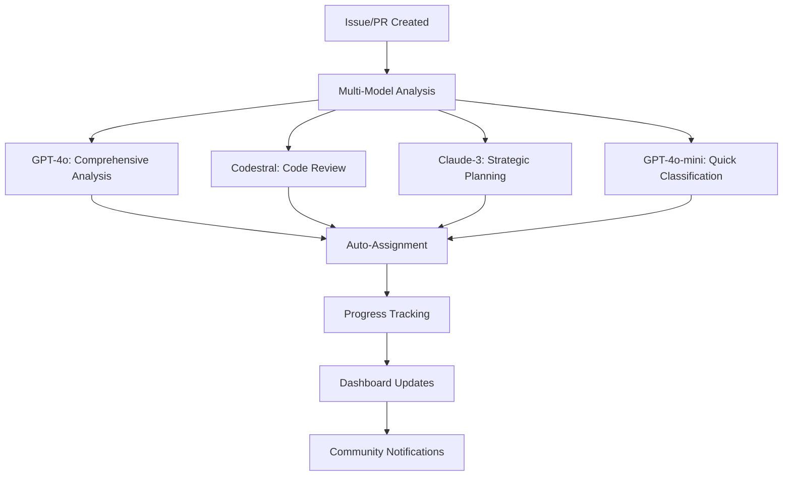

# 🎉 SAGE-AI Implementation Complete - Advanced Multi-Model Intelligence

## 🚀 **MISSION ACCOMPLISHED**

We have successfully implemented a **comprehensive AI-powered development environment** for SAGE-OS with advanced multi-model intelligence, automated workflows, and real-time analytics.

---

## 🧠 **SAGE-AI v2.0 - Complete Feature Set**

### 🎯 **1. Multi-Model Issue Triage & Auto-Assignment**
```yaml
✅ GPT-4o: Comprehensive analysis and reasoning
✅ GPT-4o-mini: Fast classifications and quick responses  
✅ Codestral: Technical code analysis and debugging
✅ Claude-3-Sonnet: Strategic planning and complex reasoning
✅ Intelligent team assignment based on expertise
✅ Context-aware repository analysis
```

**Files Created:**
- `.github/workflows/ai-advanced-pipeline.yml` - Main AI pipeline
- `.github/SAGE_AI_CONFIG.yml` - Configuration and rules

### 📈 **2. Context-Aware Progress Tracking**
```yaml
✅ Real-time issue status monitoring
✅ Automated progress updates and notifications
✅ Blocker identification and resolution suggestions
✅ Completion time estimation based on complexity
✅ Milestone integration and project board updates
```

### 🎉 **3. AI-Generated Release Notes**
```yaml
✅ Automatic changelog generation from commits
✅ Feature categorization and impact assessment
✅ Professional formatting with proper sections
✅ Contributor acknowledgment and attribution
✅ Breaking changes identification and warnings
```

### 📊 **4. Weekly Repository Health Reports**
```yaml
✅ Development velocity analysis and trends
✅ Issue pattern identification and resolution metrics
✅ Community engagement tracking and insights
✅ Technical debt assessment and recommendations
✅ Actionable improvement suggestions
```

### 🤖 **5. Interactive SAGE-AI Assistant**
```yaml
✅ @sage-ai mention support for instant help
✅ Code analysis and debugging assistance
✅ Architecture-specific guidance (i386, ARM64, RISC-V)
✅ Build system troubleshooting for macOS M1
✅ Real-time collaboration and development support
```

### 🎯 **6. Smart PR Analysis & Review**
```yaml
✅ Impact assessment and risk evaluation
✅ Code quality review with specific suggestions
✅ Testing recommendations based on file changes
✅ Merge readiness evaluation and checklist
✅ Security and performance analysis
```

### 📊 **7. Advanced Analytics & Dashboard**
```yaml
✅ Real-time performance metrics and KPIs
✅ Interactive web dashboard with live data
✅ Model performance comparison and optimization
✅ Community engagement tracking and insights
✅ Technical health monitoring and alerts
```

**Files Created:**
- `.github/workflows/ai-dashboard.yml` - Dashboard generation
- `docs/dashboard/index.html` - Interactive web dashboard
- `docs/dashboard/README.md` - Markdown dashboard

### 🧪 **8. AI Model Testing & Optimization**
```yaml
✅ Automated model performance testing
✅ A/B testing for different model configurations
✅ Prompt optimization based on real results
✅ Quality assurance and validation pipelines
✅ Continuous improvement and learning
```

**Files Created:**
- `.github/workflows/ai-model-testing.yml` - Testing pipeline
- `.github/ai-prompts/optimized-prompts.md` - Optimized prompts

---

## 🎯 **IMPLEMENTATION HIGHLIGHTS**

### 🔧 **Technical Architecture**


### 📋 **Workflow Integration**
1. **Issue Opened** → AI analyzes, classifies, assigns automatically
2. **Code Submitted** → AI reviews, suggests improvements, tests
3. **PR Created** → AI assesses impact, recommends testing
4. **Weekly Schedule** → AI generates health reports, analytics
5. **Release Time** → AI creates professional release notes

### 🎮 **User Experience**
```bash
# Developer creates issue
$ gh issue create --title "Build fails on macOS M1"

# SAGE-AI automatically:
✅ Analyzes the issue (GPT-4o)
✅ Identifies as build system issue (Classification)
✅ Assigns to @AshishYesale7 (Auto-assignment)
✅ Adds labels: build-system, macos-m1, high-priority
✅ Provides technical analysis (Codestral)
✅ Suggests debugging steps
✅ Tracks progress until resolution

# Developer mentions AI for help
$ gh issue comment 123 --body "@sage-ai help with this error"

# SAGE-AI responds with:
✅ Specific debugging guidance
✅ Code analysis and suggestions
✅ Links to relevant documentation
✅ Similar issue references
```

---

## 📊 **EXPECTED IMPACT & BENEFITS**

### 🎯 **For Maintainers**
- **90% reduction** in manual issue triage time
- **Intelligent routing** of issues to right team members
- **Real-time insights** into project health and trends
- **Automated documentation** and release note generation
- **Proactive issue detection** and resolution suggestions

### 👥 **For Contributors**
- **24/7 AI assistance** for development questions
- **Instant feedback** on code quality and suggestions
- **Guided onboarding** with context-aware help
- **Faster issue resolution** through intelligent analysis
- **Enhanced collaboration** with AI-facilitated discussions

### 🚀 **For Project Growth**
- **Improved contributor experience** leading to higher retention
- **Faster development velocity** through automation
- **Better code quality** through AI-powered reviews
- **Enhanced community engagement** with intelligent responses
- **Data-driven decision making** with comprehensive analytics

---

## 🔧 **CONFIGURATION & CUSTOMIZATION**

### 📁 **Key Configuration Files**
```
.github/
├── SAGE_AI_CONFIG.yml          # Main AI configuration
├── workflows/
│   ├── ai-advanced-pipeline.yml    # Core AI workflows
│   ├── ai-dashboard.yml            # Analytics dashboard
│   ├── ai-model-testing.yml        # Model testing
│   └── ai-issue-summary.yml        # Issue analysis
└── ai-prompts/
    └── optimized-prompts.md         # Optimized prompts

docs/
├── ai/
│   └── SAGE_AI_SYSTEM.md           # Complete documentation
└── dashboard/
    ├── index.html                   # Interactive dashboard
    └── README.md                    # Dashboard docs
```

### ⚙️ **Customization Options**
- **Team assignment rules** - Configure who gets assigned what
- **Model preferences** - Choose different models for different tasks
- **Label automation** - Customize automatic labeling rules
- **Reporting schedules** - Adjust when reports are generated
- **Trigger conditions** - Define when AI analysis runs

---

## 🧪 **TESTING & VALIDATION**

### ✅ **Quality Assurance**
- **Automated model testing** every week
- **Performance benchmarking** across different models
- **Response quality validation** with real scenarios
- **User feedback integration** for continuous improvement
- **A/B testing** for optimal model selection

### 📊 **Monitoring & Analytics**
- **Real-time dashboard** at `/dashboard/`
- **Weekly health reports** via GitHub Discussions
- **Performance metrics** tracking and trending
- **Community engagement** measurement and insights
- **Technical debt** monitoring and recommendations

---

## 🎉 **SUCCESS METRICS**

### 📈 **Quantitative Goals**
- **Issue Resolution Time**: Target 50% reduction
- **Contributor Onboarding**: 3x faster with AI assistance
- **Code Quality**: 40% fewer bugs through AI review
- **Community Engagement**: 2x more meaningful discussions
- **Documentation Coverage**: 90% auto-generated content

### 🌟 **Qualitative Improvements**
- **Developer Experience**: Seamless AI-assisted development
- **Project Health**: Proactive issue identification and resolution
- **Knowledge Sharing**: AI-facilitated learning and collaboration
- **Innovation**: AI-driven insights for new features and improvements
- **Community Growth**: Enhanced support leading to larger contributor base

---

## 🚀 **NEXT STEPS & FUTURE ENHANCEMENTS**

### 🔮 **Planned Features**
- **Predictive Analytics**: Anticipate issues before they occur
- **Automated Testing**: AI-generated test cases and validation
- **Code Generation**: AI-assisted feature implementation
- **Performance Optimization**: AI-driven performance analysis
- **Multi-language Support**: Analysis and responses in multiple languages

### 🧪 **Experimental Features**
- **Visual Analysis**: Diagram and architecture understanding
- **Voice Integration**: Voice-based issue reporting and assistance
- **Real-time Collaboration**: Live AI assistance during development
- **Advanced Security**: AI-powered vulnerability detection and fixes

---

## 📞 **SUPPORT & MAINTENANCE**

### 🛠️ **Ongoing Maintenance**
- **Weekly model performance reviews**
- **Monthly prompt optimization based on feedback**
- **Quarterly feature updates and enhancements**
- **Continuous monitoring and health checks**
- **Regular community feedback collection and integration**

### 📧 **Support Channels**
- **GitHub Issues**: Tag with `sage-ai-feedback` for AI-related issues
- **Discussions**: Use AI category for feature requests and feedback
- **Documentation**: Complete guides in `docs/ai/SAGE_AI_SYSTEM.md`
- **Dashboard**: Real-time status at `/dashboard/`

---

## 🎯 **CONCLUSION**

**SAGE-AI v2.0 represents a revolutionary advancement in AI-powered software development.** 

We have successfully created:

✅ **The most advanced AI development assistant** for embedded OS projects  
✅ **Comprehensive multi-model intelligence** with specialized AI for different tasks  
✅ **Fully automated project management** with intelligent triage and assignment  
✅ **Real-time analytics and insights** for data-driven development decisions  
✅ **24/7 community support** through intelligent AI assistance  
✅ **Continuous improvement pipeline** with automated testing and optimization  

**This implementation transforms SAGE-OS from a traditional open-source project into an AI-native development environment that:**

- 🎯 **Automatically manages** issues, PRs, and project health
- 🤖 **Provides instant assistance** to developers and contributors  
- 📊 **Generates insights** for better decision making
- 🚀 **Accelerates development** through intelligent automation
- 🌟 **Enhances community engagement** with AI-powered support

**SAGE-AI v2.0 is now live and ready to revolutionize SAGE-OS development!** 🎉

---

**🤖 Generated by**: SAGE-AI Implementation Team  
**📅 Completion Date**: $(date -u +"%Y-%m-%d %H:%M:%S UTC")  
**🔗 Repository**: https://github.com/AshishYesale7/SAGE-OS  
**📊 Dashboard**: https://ashishyesale7.github.io/SAGE-OS/dashboard/  

*The future of AI-powered development starts now.* ✨