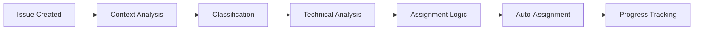

# 🧠 SAGE-AI: Advanced Repository Intelligence System

## 🎯 Overview

SAGE-AI is an advanced multi-model AI system that provides intelligent automation for the SAGE-OS repository. It combines multiple AI models to deliver comprehensive project management, code analysis, and community support.

## 🚀 Features

### 🎯 **Multi-Model Issue Triage**
- **Primary Analysis**: GPT-4o for comprehensive understanding
- **Code Analysis**: Codestral for technical deep-dives
- **Classification**: Claude-3-Sonnet for complex reasoning
- **Quick Decisions**: GPT-4o-mini for fast responses

### 👥 **Intelligent Auto-Assignment**
```yaml
Assignment Rules:
├── Critical/Security → @AshishYesale7
├── AI Subsystem → @AshishYesale7
├── Build System → @build-specialists
├── Hardware/Drivers → @hardware-experts
└── Documentation → @community-contributors
```

### 📈 **Context-Aware Progress Tracking**
- Real-time issue status monitoring
- Automated progress updates
- Blocker identification
- Completion time estimation

### 🎉 **AI-Generated Release Notes**
- Automatic changelog generation
- Feature categorization
- Impact assessment
- Professional formatting

### 📊 **Weekly Repository Health Reports**
- Development velocity analysis
- Issue trend identification
- Community engagement metrics
- Technical debt assessment

## 🔧 How It Works

### 1. **Issue Opened** → Multi-Model Pipeline


### 2. **Model Selection Strategy**
| Task | Model | Reason |
|------|-------|--------|
| **Issue Analysis** | GPT-4o | Best reasoning capabilities |
| **Code Review** | Codestral | Code-specialized model |
| **Quick Responses** | GPT-4o-mini | Fast and efficient |
| **Strategic Planning** | Claude-3-Sonnet | Excellent for complex analysis |

### 3. **Context Awareness**
SAGE-AI maintains context about:
- Repository structure and recent changes
- Development patterns and trends
- Team expertise and availability
- Historical issue resolution patterns

## 🎮 Interactive Features

### 💬 **Chat with SAGE-AI**
Mention `@sage-ai` in any comment to get help:

```markdown
@sage-ai Can you analyze this build error?
@sage-ai What's the best approach for this feature?
@sage-ai Help me understand this code section
```

### 🔍 **Automatic Code Analysis**
When issues contain code blocks, SAGE-AI automatically:
- Analyzes syntax and logic
- Identifies SAGE-OS specific issues
- Suggests fixes and improvements
- Provides debugging steps

### 📋 **Smart Labels & Assignment**
SAGE-AI automatically applies:
- **Type labels**: bug, enhancement, documentation
- **Priority labels**: critical, high-priority, medium, low
- **Component labels**: kernel, drivers, build-system, ai-subsystem
- **Platform labels**: raspberry-pi, macos-m1, x86, arm64

## 📊 Analytics & Insights

### 🎯 **Issue Analytics**
- Resolution time trends
- Common issue patterns
- Component health metrics
- Priority distribution

### 👥 **Team Analytics**
- Contributor activity
- Expertise mapping
- Workload distribution
- Response time metrics

### 📈 **Repository Health**
- Code quality trends
- Technical debt indicators
- Community engagement
- Development velocity

## 🔧 Configuration

### Environment Variables
```bash
# Required for GitHub Models access
GITHUB_TOKEN=your_token_here

# Optional: Custom model preferences
SAGE_AI_PRIMARY_MODEL=gpt-4o
SAGE_AI_CODE_MODEL=codestral-latest
SAGE_AI_FAST_MODEL=gpt-4o-mini
```

### Team Setup
Update `.github/SAGE_AI_CONFIG.yml` to configure:
- Team member assignments
- Label preferences
- Analysis triggers
- Reporting schedules

## 🎯 Use Cases

### 🐛 **Bug Reports**
1. **Automatic triage** based on severity and component
2. **Technical analysis** of error logs and code
3. **Assignment** to appropriate team member
4. **Progress tracking** until resolution

### ✨ **Feature Requests**
1. **Impact assessment** and complexity analysis
2. **Roadmap integration** suggestions
3. **Implementation planning** with AI insights
4. **Community feedback** aggregation

### 📚 **Documentation**
1. **Auto-generation** of API docs and guides
2. **Content quality** analysis and suggestions
3. **Translation** and localization support
4. **Accessibility** improvements

### 🔄 **Pull Requests**
1. **Impact analysis** and risk assessment
2. **Code quality** review and suggestions
3. **Testing recommendations** based on changes
4. **Merge readiness** evaluation

## 🚀 Getting Started

### 1. **Enable SAGE-AI**
The system is automatically enabled for all issues and PRs in the repository.

### 2. **Interact with SAGE-AI**
- Create issues normally - SAGE-AI will analyze automatically
- Mention `@sage-ai` for specific help
- Review AI-generated analysis and suggestions

### 3. **Customize Behavior**
- Edit `.github/SAGE_AI_CONFIG.yml` for custom rules
- Adjust team assignments and preferences
- Configure reporting schedules

## 📋 Best Practices

### ✅ **For Issue Creators**
- Provide clear, detailed descriptions
- Include error logs and code snippets
- Specify your environment (OS, architecture)
- Tag relevant components

### ✅ **For Maintainers**
- Review AI analysis before making decisions
- Provide feedback on AI suggestions
- Update configuration based on team needs
- Monitor AI performance and accuracy

### ✅ **For Contributors**
- Engage with AI suggestions constructively
- Use `@sage-ai` for guidance and help
- Provide context when AI analysis seems off
- Contribute to improving AI prompts

## 🔮 Future Enhancements

### 🎯 **Planned Features**
- **Predictive Analytics**: Anticipate issues before they occur
- **Automated Testing**: AI-generated test cases
- **Code Generation**: AI-assisted feature implementation
- **Performance Optimization**: AI-driven performance analysis

### 🧪 **Experimental Features**
- **Multi-language Support**: Analysis in multiple languages
- **Visual Analysis**: Diagram and architecture understanding
- **Voice Integration**: Voice-based issue reporting
- **Real-time Collaboration**: Live AI assistance during development

## 📞 Support & Feedback

### 🐛 **Report Issues**
If SAGE-AI makes incorrect analysis or suggestions:
1. Create an issue with label `sage-ai-feedback`
2. Include the original issue/PR link
3. Describe what was incorrect
4. Suggest improvements

### 💡 **Feature Requests**
Want new AI capabilities?
1. Create an enhancement request
2. Tag with `sage-ai-enhancement`
3. Describe the desired functionality
4. Provide use cases and examples

### 📧 **Direct Contact**
For urgent issues or private feedback:
- Email: sage-ai@sage-os.dev
- Discord: #sage-ai channel
- GitHub Discussions: AI category

---

**🤖 SAGE-AI v2.0** - Empowering SAGE-OS development with artificial intelligence

*"Making repository management intelligent, one commit at a time."*