# SAGE-OS Architecture Diagrams

Comprehensive visual documentation of SAGE-OS system architecture, components, and data flows.

## 🏗️ System Architecture Overview

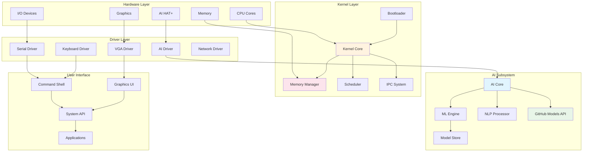

## 🧠 AI Subsystem Architecture

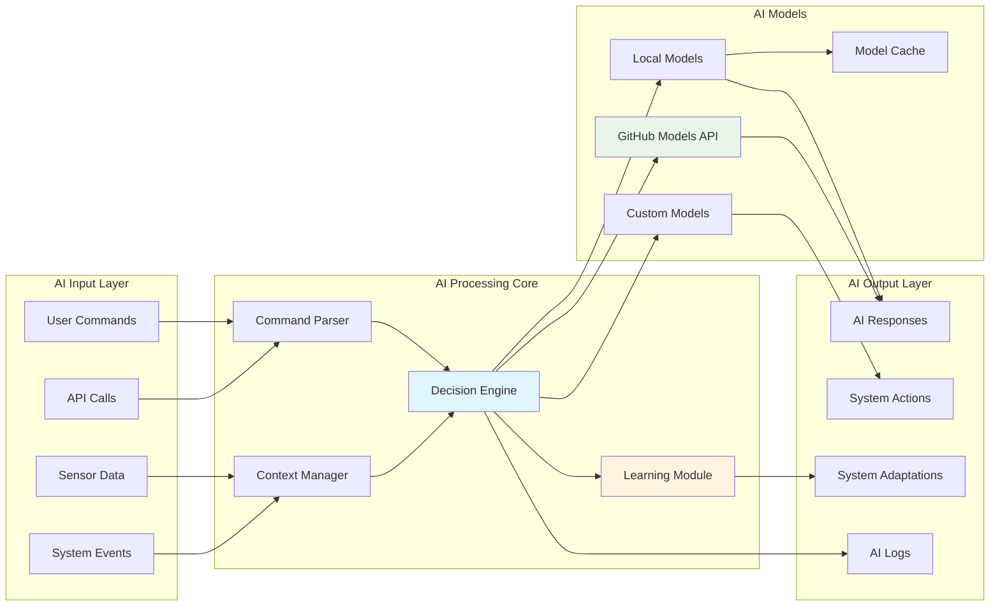

## 💾 Memory Management Architecture

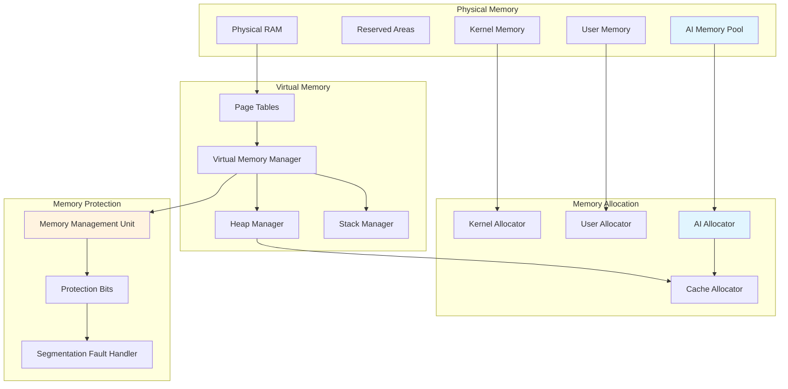

## 🔄 Boot Sequence Flow

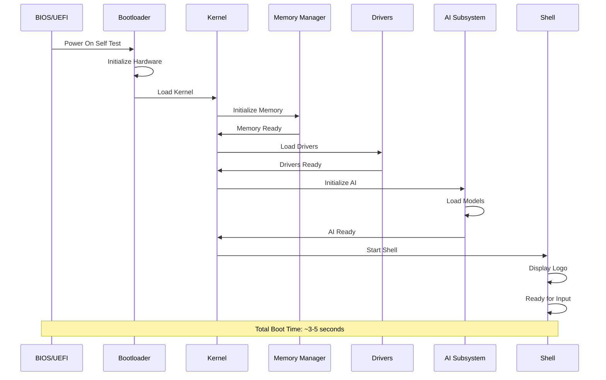

## 🖥️ Graphics System Architecture

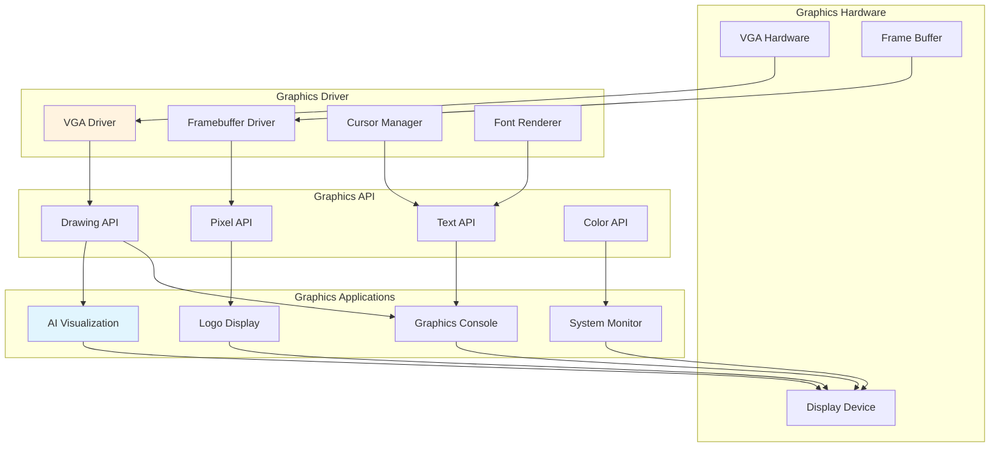

## 🌐 Network Architecture

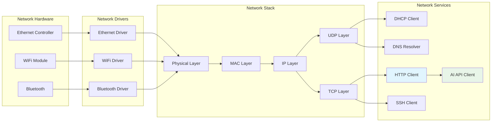

## 🔐 Security Architecture

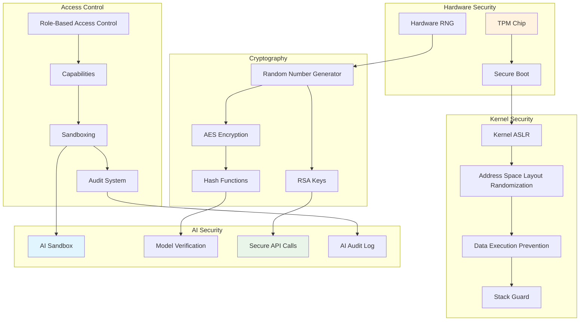

## 📊 Performance Monitoring Architecture

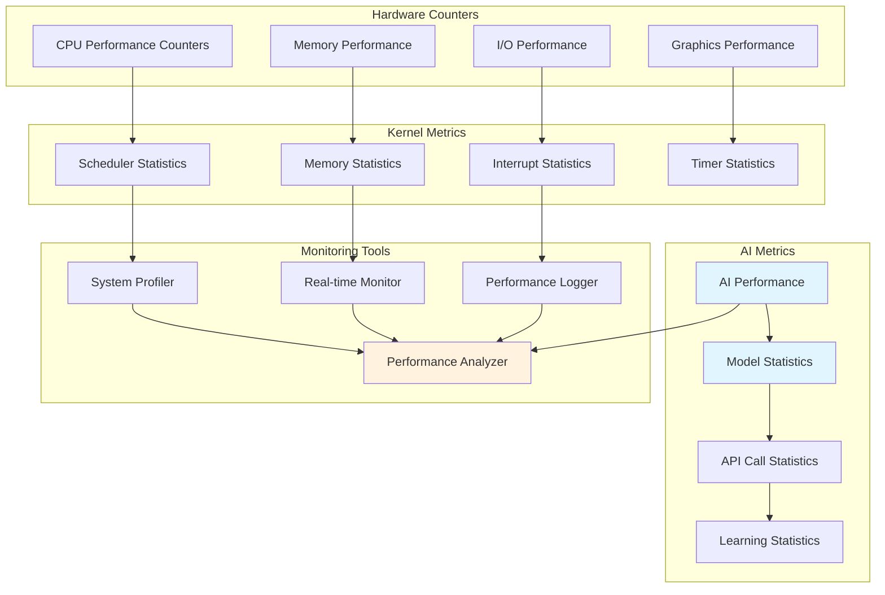

## 🔄 Inter-Process Communication

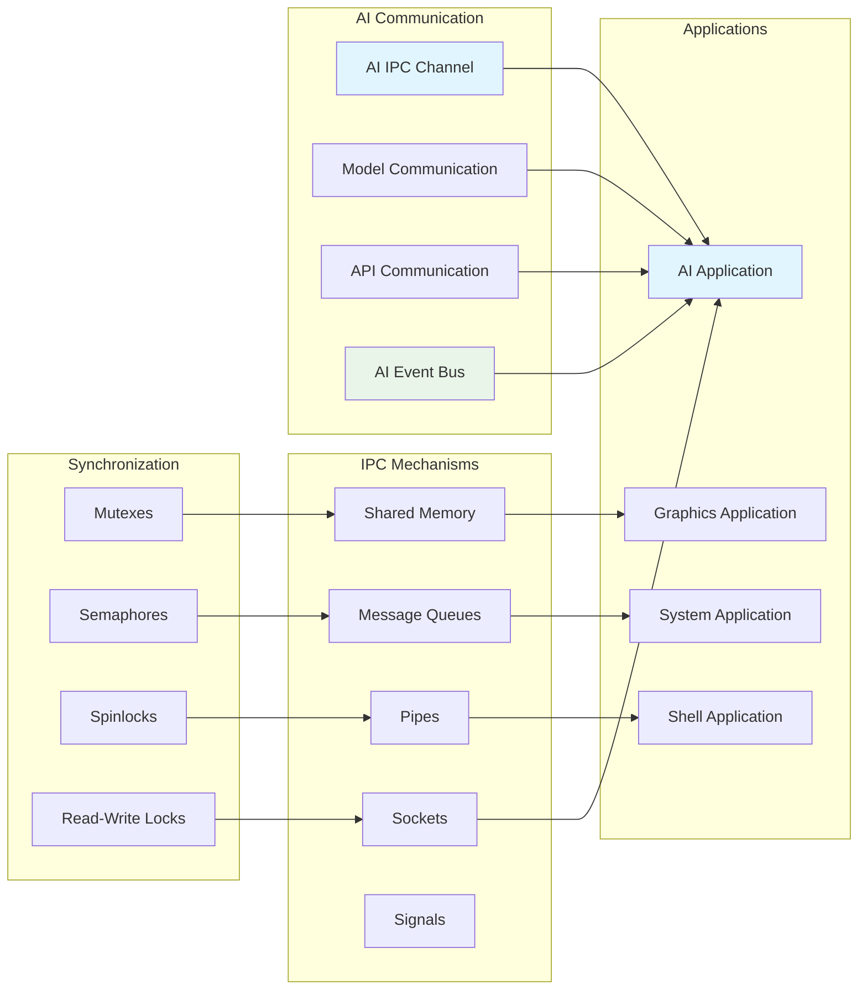

## 🎯 Multi-Architecture Support

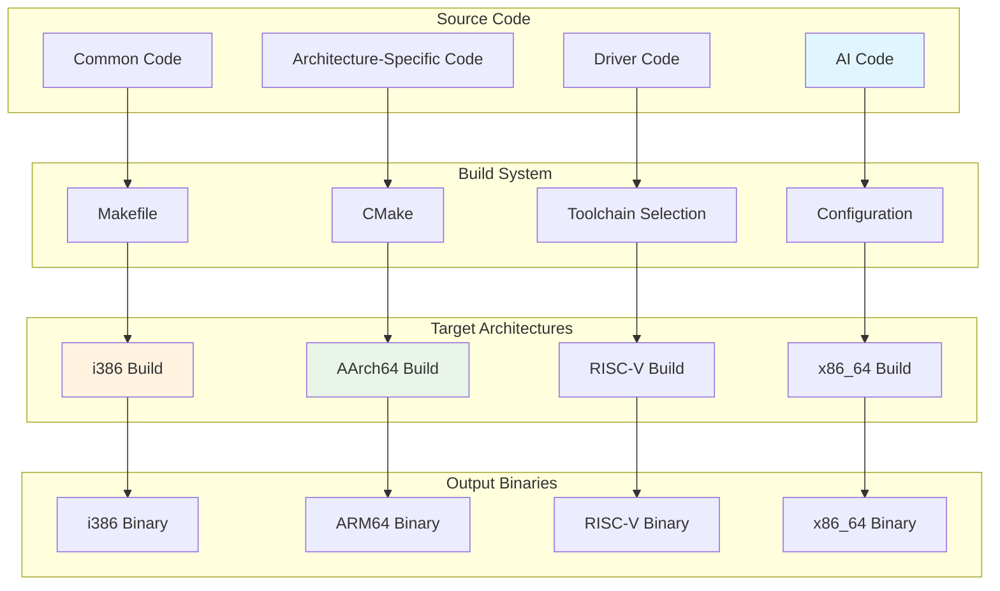

## 📱 Platform Integration

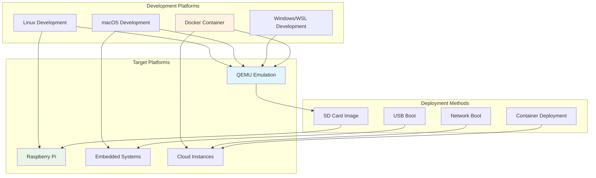

## 🔧 Development Workflow

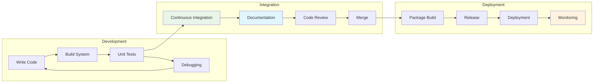

---

These diagrams provide a comprehensive visual overview of SAGE-OS architecture. Each diagram focuses on specific aspects of the system, from high-level architecture to detailed component interactions.

For interactive versions of these diagrams and additional technical details, see:
- [System Architecture](overview.md)
- [Kernel Design](kernel.md)
- [AI Integration](ai-subsystem.md)
- [Memory Management](memory.md)