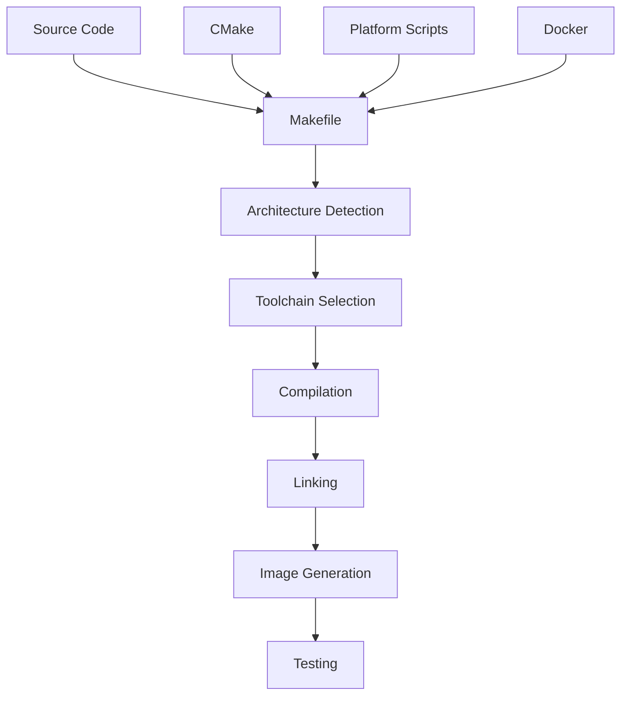

# Build Guide Overview

Comprehensive guide to building SAGE-OS from source code across all supported architectures and platforms.

## 🏗️ Build System Architecture

SAGE-OS uses a sophisticated multi-layered build system designed for cross-platform compatibility and ease of use:



### Build Components

1. **Primary Makefile** - Main build orchestration
2. **Architecture-Specific Makefiles** - Platform optimizations
3. **CMake Integration** - Modern build system support
4. **Platform Scripts** - OS-specific build helpers
5. **Docker Support** - Containerized builds
6. **Testing Integration** - Automated validation

## 🎯 Supported Build Targets

### Primary Architectures

| Architecture | Status | Toolchain | Notes |
|-------------|--------|-----------|-------|
| **i386** | ✅ Stable | GCC 32-bit | Primary development target |
| **AArch64** | ✅ Stable | GCC ARM64 | Raspberry Pi 4/5 optimized |
| **RISC-V** | ⚠️ Beta | GCC RISC-V | Experimental support |
| **x86_64** | 🔄 WIP | GCC 64-bit | Under development |
| **ARM** | 📋 Planned | GCC ARM | Future release |

### Build Variants

#### Standard Builds
```bash
make i386          # Standard i386 build
make aarch64       # ARM 64-bit build
make riscv64       # RISC-V 64-bit build
```

#### Graphics-Enabled Builds
```bash
make i386-graphics    # i386 with VGA graphics
make aarch64-graphics # ARM64 with graphics
```

#### Debug Builds
```bash
make i386-debug      # Debug symbols included
make aarch64-debug   # ARM64 debug build
```

#### Optimized Builds
```bash
make i386-release    # Optimized for performance
make aarch64-release # ARM64 optimized
```

## 🛠️ Build Requirements

### Essential Tools

#### Linux/WSL
```bash
# Ubuntu/Debian
sudo apt update
sudo apt install build-essential gcc-multilib nasm qemu-system-x86 git cmake

# Additional cross-compilation tools
sudo apt install gcc-aarch64-linux-gnu gcc-riscv64-linux-gnu

# Fedora/RHEL
sudo dnf groupinstall "Development Tools"
sudo dnf install gcc-multilib nasm qemu-system-x86 git cmake

# Arch Linux
sudo pacman -S base-devel nasm qemu git cmake
sudo pacman -S aarch64-linux-gnu-gcc riscv64-linux-gnu-gcc
```

#### macOS
```bash
# Install Xcode Command Line Tools
xcode-select --install

# Install Homebrew
/bin/bash -c "$(curl -fsSL https://raw.githubusercontent.com/Homebrew/install/HEAD/install.sh)"

# Install build dependencies
brew install gcc nasm qemu git cmake
brew install aarch64-elf-gcc riscv64-elf-gcc
```

#### Windows
```powershell
# Install WSL2
wsl --install

# Or use Docker Desktop
# Install Docker Desktop for Windows
# Use the Linux build instructions in WSL2
```

### Optional Tools

```bash
# Documentation generation
pip install mkdocs mkdocs-material

# Code analysis
sudo apt install cppcheck clang-tidy

# Performance profiling
sudo apt install valgrind perf

# Container support
sudo apt install docker.io
```

## 🚀 Quick Build Commands

### One-Command Builds
```bash
# Clean and build i386 (recommended for beginners)
make clean && make i386

# Build with automatic testing
make clean && make i386 && make test-i386

# Build all architectures
make clean && make all
```

### Platform-Specific Scripts
```bash
# Linux optimized build
./scripts/build-linux.sh

# macOS optimized build
./scripts/build-macos.sh

# Windows/WSL build
./scripts/build-windows.sh

# Raspberry Pi build
./scripts/build-raspberry-pi.sh
```

### Docker Builds
```bash
# Build using Docker
docker build -t sage-os .

# Multi-architecture Docker build
docker buildx build --platform linux/amd64,linux/arm64 -t sage-os .
```

## 📁 Build Output Structure

```
build-output/
├── i386/
│   ├── sage-os.bin          # Kernel binary
│   ├── sage-os.img          # Bootable image
│   ├── bootloader.bin       # Bootloader
│   └── symbols.map          # Debug symbols
├── aarch64/
│   ├── sage-os.bin
│   ├── sage-os.img
│   └── device-tree.dtb      # Device tree blob
├── riscv64/
│   ├── sage-os.bin
│   └── sage-os.img
└── logs/
    ├── build.log            # Build output
    ├── test.log             # Test results
    └── errors.log           # Error messages
```

## ⚙️ Build Configuration

### Makefile Variables
```bash
# Architecture selection
ARCH=i386              # Target architecture
DEBUG=1                # Enable debug build
GRAPHICS=1             # Enable graphics support
OPTIMIZE=2             # Optimization level (0-3)

# Cross-compilation
CROSS_COMPILE=aarch64-linux-gnu-  # Toolchain prefix
QEMU_ARCH=aarch64                 # QEMU architecture

# Build options
VERBOSE=1              # Verbose build output
PARALLEL=4             # Parallel build jobs
```

### CMake Configuration
```bash
# Configure with CMake
mkdir build && cd build
cmake -DCMAKE_BUILD_TYPE=Release -DARCH=i386 ..

# Build
cmake --build . --parallel 4

# Install
cmake --install . --prefix /opt/sage-os
```

### Environment Variables
```bash
# Set build environment
export SAGE_OS_ARCH=i386
export SAGE_OS_DEBUG=1
export SAGE_OS_GRAPHICS=1
export CROSS_COMPILE=aarch64-linux-gnu-

# Build with environment
make
```

## 🔧 Advanced Build Options

### Custom Kernel Configuration
```bash
# Configure kernel features
make menuconfig

# Available options:
# - Memory management settings
# - Driver selection
# - AI subsystem configuration
# - Graphics options
# - Security features
```

### Bootloader Customization
```bash
# Build custom bootloader
make bootloader BOOTLOADER_CONFIG=custom

# Options:
# - Boot splash screen
# - Memory layout
# - Hardware detection
# - Security features
```

### Driver Selection
```bash
# Build with specific drivers
make i386 DRIVERS="vga,serial,keyboard,ai_hat"

# Available drivers:
# - vga: VGA graphics driver
# - serial: Serial communication
# - keyboard: PS/2 keyboard
# - ai_hat: AI HAT+ support
# - ethernet: Network support
```

## 🧪 Build Testing

### Automated Testing
```bash
# Run all tests
make test

# Architecture-specific tests
make test-i386
make test-aarch64
make test-riscv64

# Specific test suites
make test-boot        # Boot sequence tests
make test-memory      # Memory management tests
make test-drivers     # Driver functionality tests
make test-ai          # AI subsystem tests
```

### Manual Testing
```bash
# Boot test in QEMU
make run-i386

# Graphics test
make run-graphics

# Network test
make run-network

# Performance test
make run-benchmark
```

### Continuous Integration
```bash
# GitHub Actions integration
.github/workflows/build-kernel.yml

# Local CI simulation
./scripts/ci-build.sh
```

## 📊 Build Performance

### Optimization Tips

1. **Parallel Builds**
   ```bash
   # Use all CPU cores
   make -j$(nproc) i386
   
   # Limit parallel jobs
   make -j4 i386
   ```

2. **RAM Disk Builds**
   ```bash
   # Create RAM disk (Linux)
   sudo mkdir /mnt/ramdisk
   sudo mount -t tmpfs -o size=2G tmpfs /mnt/ramdisk
   cp -r SAGE-OS /mnt/ramdisk/
   cd /mnt/ramdisk/SAGE-OS
   make i386
   ```

3. **Incremental Builds**
   ```bash
   # Only rebuild changed files
   make i386
   
   # Force full rebuild
   make clean && make i386
   ```

4. **Compiler Optimization**
   ```bash
   # Optimize for speed
   make i386 OPTIMIZE=3
   
   # Optimize for size
   make i386 OPTIMIZE=s
   
   # Debug build (no optimization)
   make i386 DEBUG=1
   ```

### Build Time Benchmarks

| Architecture | Clean Build | Incremental | With Tests |
|-------------|-------------|-------------|------------|
| i386 | 2-3 minutes | 30 seconds | 5-7 minutes |
| AArch64 | 3-4 minutes | 45 seconds | 6-8 minutes |
| RISC-V | 4-5 minutes | 1 minute | 8-10 minutes |

## 🐛 Troubleshooting Builds

### Common Build Issues

#### 1. Missing Dependencies
```bash
# Check dependencies
./scripts/check-dependencies.sh

# Install missing packages
sudo apt install build-essential gcc-multilib
```

#### 2. Cross-Compilation Errors
```bash
# Verify toolchain
aarch64-linux-gnu-gcc --version

# Install cross-compiler
sudo apt install gcc-aarch64-linux-gnu
```

#### 3. Linker Errors
```bash
# Check linker script
cat linker.ld

# Verify memory layout
objdump -h sage-os.bin
```

#### 4. QEMU Issues
```bash
# Test QEMU installation
qemu-system-i386 --version

# Try different QEMU options
qemu-system-i386 -nographic -kernel sage-os.bin
```

### Debug Build Issues

#### Enable Verbose Output
```bash
# Verbose Makefile
make V=1 i386

# Verbose compiler
make VERBOSE=1 i386
```

#### Check Build Logs
```bash
# View build log
cat build-output/logs/build.log

# Check for errors
grep -i error build-output/logs/build.log
```

#### Validate Build Output
```bash
# Check binary format
file sage-os.bin

# Verify symbols
nm sage-os.bin | grep main

# Check size
ls -lh sage-os.bin
```

## 📚 Next Steps

After successfully building SAGE-OS:

1. **Test Your Build**
   - [Testing Guide](../development/testing.md)
   - [QEMU Testing](../development/debugging.md)

2. **Customize the Build**
   - [Cross Compilation](cross-compilation.md)
   - [Platform Specific](platform-specific.md)

3. **Deploy to Hardware**
   - [Raspberry Pi Deployment](../platforms/raspberry-pi/DEVELOPER_GUIDE.md)
   - [Hardware Testing](../development/testing.md)

4. **Contribute to Development**
   - [Development Setup](../development/setup.md)
   - [Contributing Guide](../development/contributing.md)

---

*Ready to build? Start with our [Quick Start Guide](../getting-started/quick-start.md) or dive into [Cross Compilation](cross-compilation.md) for advanced builds.*