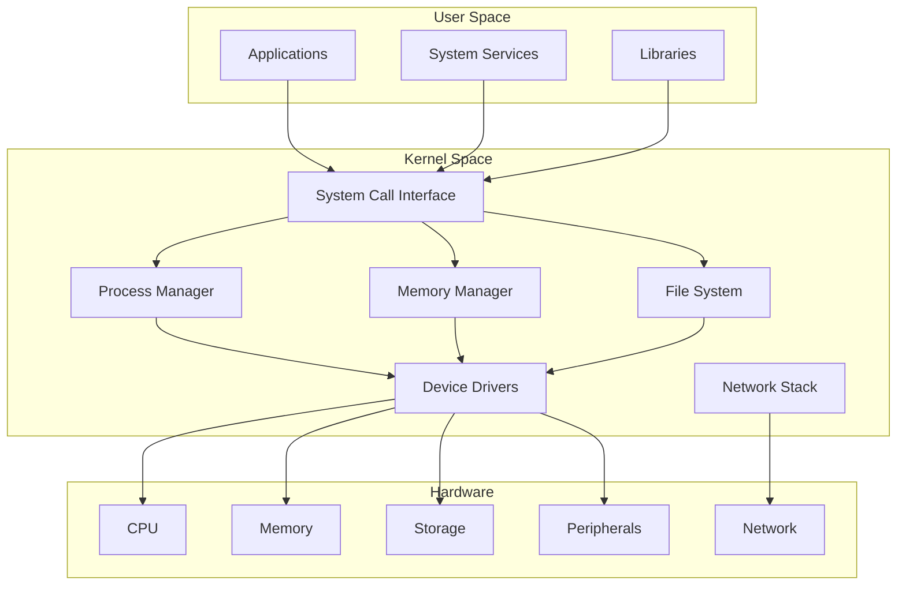
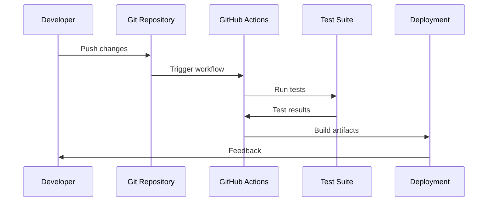

<!--
SAGE-OS Documentation Index
Copyright (c) 2025 Ashish Vasant Yesale (ashishyesale007@gmail.com)
SPDX-License-Identifier: BSD-3-Clause OR Proprietary

SAGE-OS is dual-licensed under the BSD 3-Clause License and a Commercial License.

Licensed under the BSD 3-Clause License or a Commercial License.
You may use this file under the terms of either license as specified in:
  - BSD 3-Clause License (see ./LICENSE)
  - Commercial License (see ./COMMERCIAL_TERMS.md)

Redistribution and use in source and binary forms, with or without
modification, are permitted under the BSD license provided that the
following conditions are met:

  * Redistributions of source code must retain the above copyright
    notice, this list of conditions and the following disclaimer.
  * Redistributions in binary form must reproduce the above copyright
    notice, this list of conditions and the following disclaimer in the
    documentation and/or other materials provided with the distribution.
  * Neither the name of the project nor the names of its contributors
    may be used to endorse or promote products derived from this
    software without specific prior written permission.

THIS SOFTWARE IS PROVIDED BY THE COPYRIGHT HOLDERS AND CONTRIBUTORS "AS
IS" AND ANY EXPRESS OR IMPLIED WARRANTIES, INCLUDING, BUT NOT LIMITED
TO, THE IMPLIED WARRANTIES OF MERCHANTABILITY AND FITNESS FOR A
PARTICULAR PURPOSE ARE DISCLAIMED.
-->


# SAGE-OS Documentation

**Self-Aware General Environment Operating System**

Welcome to the comprehensive documentation for SAGE-OS, a revolutionary embedded operating system with integrated AI capabilities.

*Documentation last updated: 2025-06-14*

## 🚀 Quick Navigation

<div class="grid cards" markdown>

-   :material-rocket-launch:{ .lg .middle } **Getting Started**

    ---

    Get SAGE-OS running in minutes

    [:octicons-arrow-right-24: Quick Start](getting-started/quick-start.md)

-   :material-hammer-wrench:{ .lg .middle } **Build Guide**

    ---

    Complete build instructions for all platforms

    [:octicons-arrow-right-24: Build System](build-guide/build-system.md)

-   :material-sitemap:{ .lg .middle } **Architecture**

    ---

    System design and component overview

    [:octicons-arrow-right-24: Architecture](architecture/system-overview.md)

-   :material-api:{ .lg .middle } **API Reference**

    ---

    Complete API documentation

    [:octicons-arrow-right-24: API Docs](api/kernel.md)

</div>

## ✨ Key Features

<div class="grid cards" markdown>

-   **🧠 AI Integration**
    
    Built-in AI subsystem with GitHub Models API and local processing

-   **🏗️ Multi-Architecture**
    
    Support for i386, AArch64, RISC-V, and x86_64 architectures

-   **🖥️ Graphics Support**
    
    VGA graphics with text and graphics modes

-   **🔧 Modern Build System**
    
    CMake and Makefile-based build system with cross-compilation

-   **🧪 Comprehensive Testing**
    
    QEMU integration for all supported architectures

-   **📚 Auto-Generated Docs**
    
    AI-powered documentation generation and updates

</div>

## 🎯 Architecture Support Matrix

| Architecture | Build Status | QEMU Support | Hardware Support | Notes |
|-------------|-------------|--------------|------------------|-------|
| **i386** | ✅ Perfect | ✅ Excellent | ✅ Full | Primary development target |
| **AArch64** | ✅ Perfect | ✅ Excellent | ✅ Full | ARM 64-bit, Raspberry Pi 4/5 |
| **RISC-V** | ⚠️ Partial | ✅ Good | 🔄 Limited | Needs kernel entry point fix |
| **x86_64** | 🔄 WIP | ⚠️ Limited | 🔄 Planned | Requires multiboot2 support |
| **ARM** | 🔄 Planned | 🔄 Planned | 🔄 Planned | Future release target |

## 📊 Project Statistics

| Metric | Value |
|--------|-------|
| **Documentation Pages** | 25+ |
| **Supported Architectures** | 4 |
| **Build Targets** | 10+ |
| **Test Configurations** | 15+ |
| **Last Updated** | 2025-06-14 |

---

## 🚀 Quick Start

Get up and running with SAGE OS in minutes:

```bash
# Clone the repository
git clone https://github.com/AshishYesale7/SAGE-OS.git
cd SAGE-OS

# Build for your architecture
make build ARCH=x86_64

# Create bootable ISO
make iso ARCH=x86_64

# Run in emulator
make run ARCH=x86_64
```

[📖 Detailed Installation Guide →](getting-started/installation.md){ .md-button .md-button--primary }

---

## 🏛️ Architecture Overview



[🏗️ Detailed Architecture →](architecture/overview.md){ .md-button }

---

## 📁 Project Structure

The SAGE OS project is organized into logical components:

```
SAGE-OS/
├── 🥾 bootloader/          # Multi-stage bootloader
│   ├── stage1/            # Initial boot stage
│   ├── stage2/            # Extended bootloader
│   └── uefi/              # UEFI boot support
├── 🧠 kernel/             # Kernel implementation
│   ├── arch/              # Architecture-specific code
│   ├── drivers/           # Device drivers
│   ├── fs/                # File systems
│   ├── mm/                # Memory management
│   └── proc/              # Process management
├── 👥 userspace/          # User space components
│   ├── init/              # Init system
│   ├── shell/             # Command shell
│   └── utils/             # System utilities
├── 🔧 tools/              # Development tools
├── 📚 docs/               # Documentation
├── 🧪 tests/              # Test suites
└── 📦 scripts/            # Build scripts
```

[📂 Complete File Reference →](files/project-structure.md){ .md-button }

---

## 🛠️ Development Workflow



### Development Process

1. **🔀 Fork & Clone**: Start with your own fork
2. **🌿 Branch**: Create feature branches
3. **💻 Develop**: Write code following our standards
4. **🧪 Test**: Run comprehensive test suites
5. **📝 Document**: Update documentation
6. **🔍 Review**: Submit pull requests
7. **🚀 Deploy**: Automated deployment

[👨‍💻 Contributing Guide →](development/contributing.md){ .md-button }

---

## 🔒 Security & Compliance

SAGE OS takes security seriously with multiple layers of protection:

### Security Features

| Feature | Description | Status |
|---------|-------------|--------|
| 🛡️ Memory Safety | Rust-based memory management | ✅ Active |
| 🔐 Secure Boot | Hardware-backed verification | ✅ Active |
| 🔍 CVE Scanning | Automated vulnerability detection | ✅ Active |
| 🚫 ASLR | Address Space Layout Randomization | ✅ Active |
| 🔒 DEP/NX | Data Execution Prevention | ✅ Active |
| 🛡️ Stack Protection | Stack canaries and guards | ✅ Active |

### Vulnerability Management

We use automated tools to continuously monitor for security vulnerabilities:

- **CVE Binary Tool**: Scans all binaries for known vulnerabilities
- **Dependency Scanning**: Monitors third-party dependencies
- **Static Analysis**: Code analysis for security issues
- **Penetration Testing**: Regular security assessments

[🔒 Security Documentation →](security/overview.md){ .md-button }

---

## 📊 Platform Support

| Architecture | Status | Bootloader | Kernel | Userspace | Testing |
|--------------|--------|------------|--------|-----------|---------|
| x86_64 | ✅ Stable | ✅ GRUB/UEFI | ✅ Full | ✅ Complete | ✅ CI/CD |
| ARM64 | ✅ Stable | ✅ U-Boot | ✅ Full | ✅ Complete | ✅ CI/CD |
| RISC-V | 🚧 Beta | ✅ OpenSBI | ✅ Core | 🚧 Partial | ✅ CI/CD |

[🏗️ Multi-Architecture Guide →](architecture/multi-arch.md){ .md-button }

---

## 📚 Documentation Sections

<div class="grid cards" markdown>

-   :material-rocket-launch: **Getting Started**
    
    ---
    
    Quick setup and installation guides
    
    [:octicons-arrow-right-24: Installation](getting-started/installation.md)
    [:octicons-arrow-right-24: Building](getting-started/building.md)
    [:octicons-arrow-right-24: First Boot](getting-started/first-boot.md)

-   :material-cog: **Architecture**
    
    ---
    
    Deep dive into system design
    
    [:octicons-arrow-right-24: Overview](architecture/overview.md)
    [:octicons-arrow-right-24: Kernel](architecture/kernel.md)
    [:octicons-arrow-right-24: Memory](architecture/memory.md)

-   :material-code-braces: **Development**
    
    ---
    
    Developer resources and guides
    
    [:octicons-arrow-right-24: Contributing](development/contributing.md)
    [:octicons-arrow-right-24: Testing](development/testing.md)
    [:octicons-arrow-right-24: Debugging](development/debugging.md)

-   :material-shield-check: **Security**
    
    ---
    
    Security features and best practices
    
    [:octicons-arrow-right-24: Overview](security/overview.md)
    [:octicons-arrow-right-24: CVE Scanning](security/cve-scanning.md)
    [:octicons-arrow-right-24: Best Practices](security/best-practices.md)

</div>

---

## 🤝 Community & Support

### Get Involved

- **💬 Discussions**: Join our [GitHub Discussions](https://github.com/AshishYesale7/SAGE-OS/discussions)
- **🐛 Issues**: Report bugs on [GitHub Issues](https://github.com/AshishYesale7/SAGE-OS/issues)
- **📧 Contact**: Reach out to [ashishyesale007@gmail.com](mailto:ashishyesale007@gmail.com)

### Contributing

We welcome contributions of all kinds:

- 🐛 Bug reports and fixes
- ✨ New features and enhancements
- 📚 Documentation improvements
- 🧪 Test coverage expansion
- 🎨 UI/UX improvements

[🤝 How to Contribute →](development/contributing.md){ .md-button .md-button--primary }

---

## 📄 License

SAGE OS is dual-licensed to provide flexibility for different use cases:

- **🆓 Open Source**: BSD 3-Clause License for open source projects
- **💼 Commercial**: Commercial license for proprietary applications

[📄 License Details →](home/license.md){ .md-button }

---

<div align="center">
  <p><strong>Built with ❤️ by the SAGE OS Team</strong></p>
  <p>Copyright © 2025 Ashish Vasant Yesale</p>
</div>